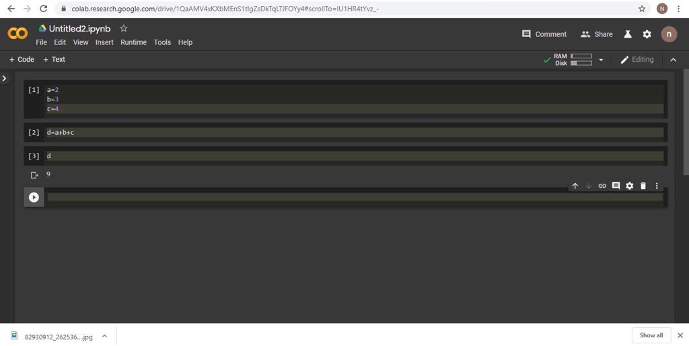

<h1>การบ้านครั้งที่1<h1>
ชื่อ-นามสกุล<h1>
นายนิธิศ ประวิตรกาญจน์ 603021869-1 <h1>

## วิธีการดาวน์โหลดโปรแกรม Anconda <h1>
-   1.เข้าเว็บบราวเซอร์ 
   

   - 2.[ค้นหาโปรแกรม Mini conda](https://docs.conda.io/en/latest/miniconda.html)
   
-   3.เลือกเวอร์ชั่นของโปรแกรม Python version            และรูปแบบการทำงานของ CPU 32,64 bit  
     

-   4.กดติดตั้งโปรแกรม  
- 5.เมื่อติดตั้งโปรแกรมเสร็จแล้วให้กด Finish
- 6.กดปุ่มรูปwindows หรือปุ่ม start menu ค้นหา cmd
      
- 7.พิมพ์ "python"เพื่อเช็คความถูกต้องของ Anconda
     
- 8.ตั้งค่าให้ jupyter จัดเก็บโฟนเดอร์ที่ต้องการ     * ใช้คำสั่ง cd ""
- 9.ติดตั้ง matplotlib
   * ใช้คำสั่ง conda install matplotlib

- 10.คำสั่ง install jupyter notebook

## วิธีใช้งาน GOOGLE COLAB <h1>
- 1.[เข้าหน้าเว็บ google colab](https://colab.research.google.com/notebooks/welcome.ipynb)

- 2.ทำการ login เข้าสู่ระบบที่มุมขวาบน 

- 3.เลือก New python ตามที่ต้องการ

- 4.เข้าสู่หน้า python 

## วิธีใช้งาน git hub <h1>
- 1.[สมัครใช้งาน gib hub](https://github.com/)

- 2.เลือก sign up for git hub

- 3.Create account
- 4.เข้า email เพื่อยืนยันการสมัคร

- 5.เชื่อมต่อเข้ากับ Anconda
- 6.พิมพ์ git add เพื่อเพิ่มไฟล์
- 7.พิมพ์ git commit -m "test git"
- 8.พิมพ์ git push
    - เข้าสู่ระบบตาม Username และ password ที่สมัครไว้

 